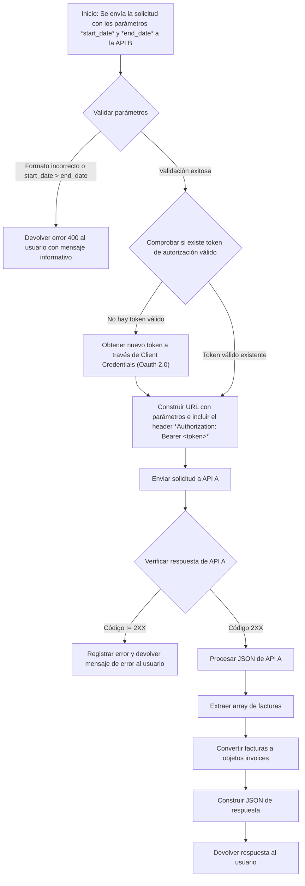

# Propuesta para ejercicio de integración de APIs


## Objetivo de integración
La API B debe ser capaz de obtener datos de la API A y transformarlos de forma que pueda usarlos internamente o devolverlos a los consumidores de la API B.

## Pasos de ejecución tras la integración
1. Un consumidor de la API B llama al endpoint de B de consulta de facturas con start_date y end_date
2. El servicio de la API B internamente llama al endpoint de la API A, debido a que comparten el formato de fecha, no debería necesitar transformar las fechas, salvo que internamente por otro motivo ya se haga algún tratamiento.
3. El servicio B internamente mapea los datos de la respuesta de la API A al formato de la respuesta del endpoint de la API B
4. Se devuelve al consumidor la respuesta de la API B.

Si se añadieran otras fuentes de datos, se repetirían los pasos 2 y 3 para cada fuente.

## Descripción de las APIs
### API A: Sistema de Facturación A
- Endpoint de Consulta de Facturas:
  - **URL**: https://api.sistemaA.com/facturas
  - **Método**: GET
  - **Parámetros de consulta**:
    - **fecha_inicio**: formato YYYY-MM-DD
    - **fecha_fin**: formato YYYY-MM-DD
  - **Autenticación**: 
    - Bearer Token en el encabezado *Authorization: Bearer \<token\>*
    - El token se obtiene mediante el flujo de client credentials (OAuth 2.0).
  - **Formato de respuesta**: JSON con las facturas emitidas entre *fecha_inicio* y *fecha_fin*
  - Ejemplo de respuesta:
    ```json
    {
        "facturas": [
        {
            "id": "123",
            "cliente": "Empresa XYZ",
            "monto": 1500.75,
            "fecha_emision": "2023-05-01",
            "estado": "pagada"
        },
        ...
        ]
    }

### API B: Sistema de Facturación B
- Endpoint de Consulta de Facturas:
  - **URL**: https://api.sistemaB.com/bills
  - **Método**: GET
  - **Parámetros de consulta**:
    - **start_date**: formato YYYY-MM-DD
    - **end_date**: formato YYYY-MM-DD
  - **Autenticación**: 
    - Campo *x-api-key* en el encabezado
  - **Formato de respuesta**: JSON con las facturas emitidas entre *fecha_inicio* y *fecha_fin*
  - Ejemplo de respuesta:
    ```json
    {
        "invoices": [
        {
            "invoice_id": "123",
            "customer": "Company XYZ",
            "amount_due": 1500.75,
            "date_issued": "2023-05-01",
            "status": "unpaid"
        },
        ...
        ]
    }

## Detalles de los requisitos de Integración
### Mapeo para llamada de la API B a la API A:	
<div align="center">

| PARÁMETRO DE API B | PARÁMETRO DE API A |
| ------------------ | ------------------ |
| start_date         | fecha_inicio       |
| end_date           | fecha_fin          |

</div>

### Mapeo de respuestas de la API A a API B:	
<div align="center">

| RESPUESTA DE API A | CAMPO EN API B |
| ------------------ | -------------- |
| id                 | invoice_id     |
| cliente            | customer       |
| monto              | amount_due     |
| fecha_emision      | date_issued    |
| estado             | status         |

</div>

Tener en cuenta que *estado* en A es pagada, y *status* sería paid. Por lo tanto, habría que establecer una equivalencia entre los posibles valores de *estado* y *status*. Un ejemplo sería:
<div align="center">

| VALOR DE ESTADO | EQUIVALENCIA STATUS |
| --------------- | ------------------- |
| pagada          | paid                |
| sin pagar       | unpaid              |

</div>

### Autenticación y seguridad: 
- Para API A:
  - Obtener el Bearer token mediante un flujo de OAuth 2.0 con client credentials.
  - Guardar el token de forma segura (por ejemplo, en un sistema de manejo de secretos).
  - Usar refresh tokens o solicitar uno nuevo en cada llamada
- Para API B:
  - El acceso se realiza usando la x-api-key.
  - La API key también debe guardarse de forma segura.
- Seguridad Adicional:
  - Usar HTTPS (TLS) para proteger las credenciales.
  - Revisar políticas de rate limiting en cada API para evitar bloqueos por exceso de llamadas.

### Transformación de Datos: 
- Los datos JSON deben transformarse según el esquema que la API B espera.
- Iterar sobre el array “facturas” que retorna la API A, y construir un nuevo array “invoices” con el formato que la API B define.
- Ejemplo de transformación:
    ```json
    // Factura original de A: 
    { 
        "id": "123", 
        "cliente": "Cliente X", 
        "monto": 100, 
        "fecha_emision": "2023-05-01", 
        "estado": "pagada" 
    } 
    // Factura transformada a B:
    { 
        "invoice_id": "123", 
        "customer": "Cliente X", 
        "amount_due": 100, 
        "date_issued": "2023-05-01", 
        "status": "paid" // Suponiendo que 'pagada' => 'paid'
    }

### Consideraciones para el manejo de errores
- Manejar códigos de respuesta HTTP de la API A.
- Configurar reintentos tras un timeout razonable.
- Logs y Monitoring: Registrar los datos de llamadas y tiempos  para depuración y análisis de rendimiento.

### Fuentes de datos adicionales
- Si se requiere combinar datos no solo de la API A, sino de otros orígenes (por ejemplo, una base de datos interna de B o un servicio de terceros), se puede generar un proceso de agregación:
  - Invocar a la API A y obtener sus facturas.
  - Invocar a la otra fuente (o DB interna) y obtener datos de facturas/otros metadatos.
  - Combinar esos datos en un solo esquema y luego transformarlos al formato final de B.
- Si la cantidad de memoria usada se vuelve un problema y las herramientas lo permiten, se podrían tratar los datos de cada llamada en orden y liberar la memoria de los datos que ya no se usarán antes de pasar a la siguiente fuente de datos.

## Recomendaciones:
- Almacenar credenciales de forma segura, por ejemplo en sistemas de manejos de secretos.
- Aplicando principios SOLID, se podría crear una clase/servicio para encargarse de la transformación de datos, además de diseñar una interfaz por si se añaden nuevas fuentes de datos.
- Manejar los posibles errores (timeout, códigos de error 4XX y 5XX, errores de autenticación)
- Si se genera como servicio aparte, añadir monitoreo de los tiempos y consumo de memoria.

1. Obtener rango de fechas:
   - El consumidor envia al endpoint de la API b los parámetros start_date y end_date.
   - El servicio B valida formato y que start_date <= end_date.
2. Llamar a la API A incluyendo en el header "Authorization: Bearer <token>", debido a que los parámetros no incluyen datos confidenciales, se podrían añadir en la url, de forma que la url sea: https://api.sistemaA.com/facturas?fecha_inicio=<start_date>&fecha_fin=<end_date>
3. Verificar código de respuesta 2XX.
4. Procesar JSON para obtener un array de objetos facturas
5. Procesar el array para convertir los objetos facturas a objetos invoices
6. Generar la respuesta json { "invoices": [ ... ] }
7. Devolver al usuario que llamó a la API B

## Flujo de ejecución API B

